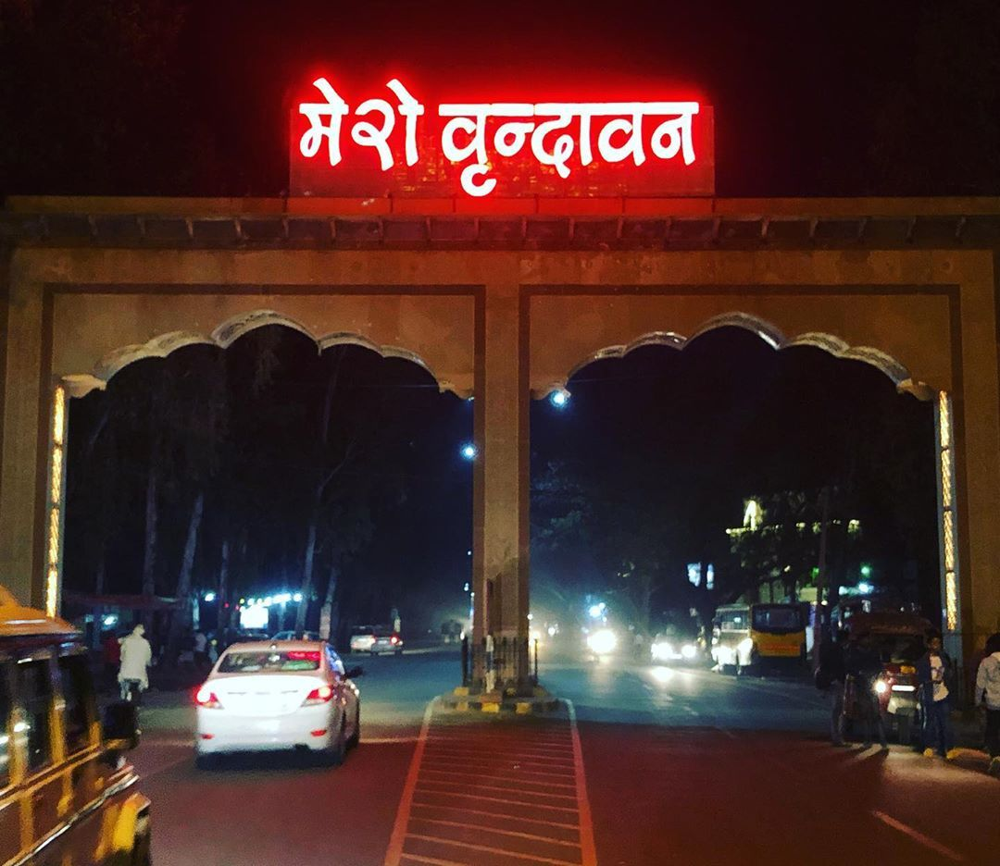
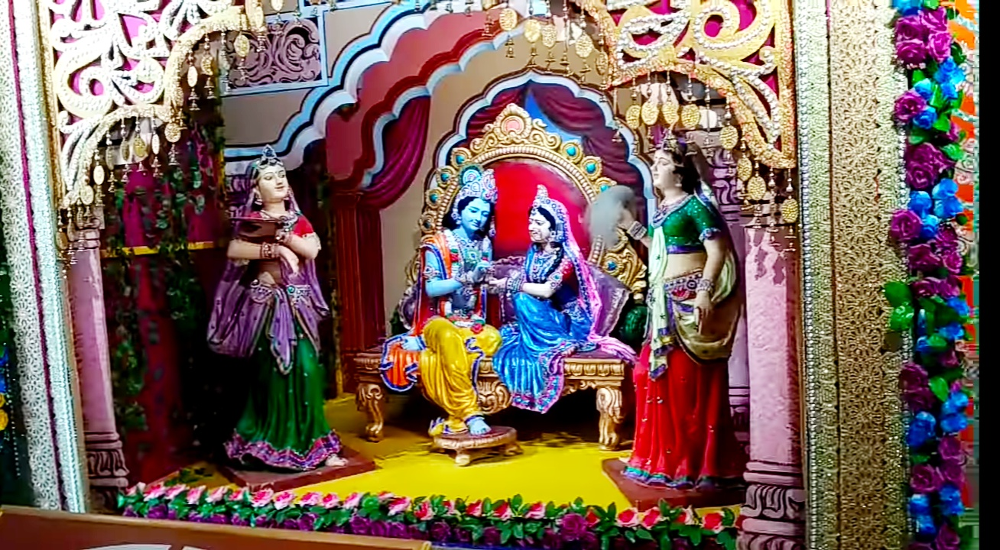
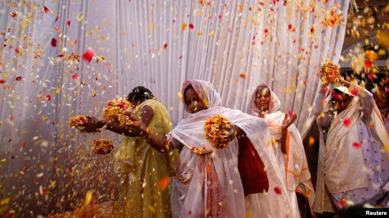
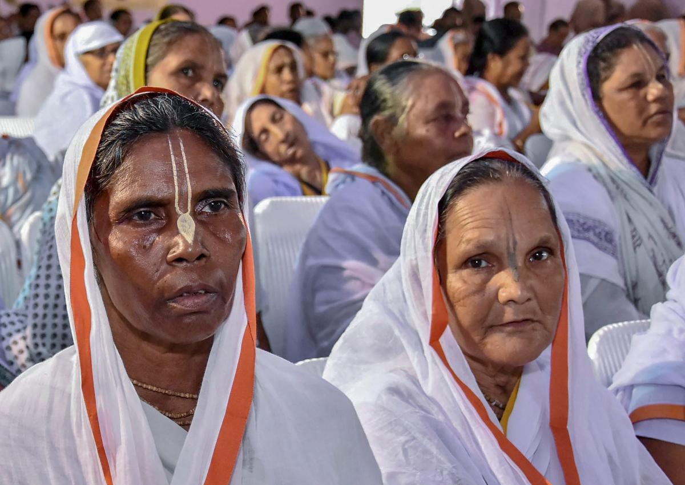
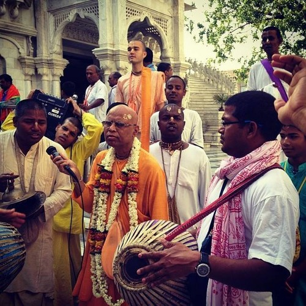

# vrindavan

<html>
   <head>
     <title>html project</title>
   </head>
        <body bgcolor = "AD85BA">
           <table border = "0" width = "100%" cellpadding= "0" bgcolor = "#f3971b">
              <tr>
                <td>
                   VRINDAVAN
                </td>
                 <td>
                       &nbsp;
                 </td>
                 <td>
                   <a href = "#about"> About</a>
                 </td> 
                 <td>
                   <a href = "attraction sites.html"> Attraction Sites</a>
                 </td>
                 <td>
                   <a href = "street food.html">Street Food</a>
                 </td>
                 <td>
                   <a href = "upcoming events.html">Upcoming Events</a>
                 </td>
                 <td>
                   <a href = "stay.html">Hotels To Stay</a>
                 </td>
                 <td>
                   <a href = "donation.html">Donation</a>
                 </td>
               </tr>
            </table>

                   <b><u>Vrindavan</u></b> , also known as <b><u>Brindaban</u></b> , is a historical city in the <i>Mathura district of Uttar Pradesh, India</i>. It                        is one of the most sacred places in Vaishnavism. It is located in the Braj Bhoomi region, and is where, according to Hinduism, <b><i><u>Lord Krishna</u></i></b> spent most of his                       childhood days. The city is about 11 km from <i>Mathura</i>, Krishna's birthplace on the <i>Agra-Delhi National Highway as NH-44</i> , The town hosts many temples dedicated to                     the worship of <b><i><u>Radha and Krishna</u></i></b>.   

                       

                         
                       

                    <a name = "about">  

                    <b><u>Vrindavan</u></b> is considered to be a holy place for <i>Vaisnavism tradition of Hinduism</i>. It is a center of Krishna worship and the area includes places like                                        <b><i>Govardhana</i></b> and <b><i>Gokul</i></b> that are associated with <i>Krishna</i>. Millions of devotees of Radha Krishna visit these places of pilgrimage every year and                       participate in a number of festivals <b><u>Vrindavan</u></b> has an ancient past, associated with Hindu culture and history, and was established in the 16th and 17th centuries as                      a result of an explicit treaty between Muslims and Hindu Emperors,  and is an important Hindu pilgrimage site since long. 

                   Of the contemporary times, <i>Vallabhacharya</i>, aged eleven visited <b><u>Vrindavan</u></b>. Later on, he performed three pilgrimages of India, barefoot giving discourses on                       <i><u>Bhagavad Gita</u></i> at 84 places. These 84 places are known as <i>Pushtimarg Baithak</i> and since then are the places of pilgrimage. Yet, he stayed in <b><u>                                     Vrindavan</u></b> for four months each year. Vrindavan thus heavily influenced his formation of Pushtimarg. 

                     

                        
                     

                 The essence of  <b><u> Vrindavan</b></u>  was lost over time until the 16th century, when it was rediscovered by <i>Chaitanya Mahaprabhu </i>. In the year 1515, <i>Chaitanya                  Mahaprabhu</i> visited <b><u> Vrindavan</b></u> , with the purpose of locating the lost holy places associated with <i>Krishna's</i> life. 

                        

                 In the last 250 years, the extensive forests of <b><u> Vrindavan</b></u>  have been subjected to urbanisation, first by local Rajas and in recent decades by apartment developers.                  The forest cover has been whittled away to only a few remaining spots, and the local wildlife, including <u>peacocks, cows, monkeys and a variety of bird species</u> has been                  virtually eliminated. Only a <u>few peacocks are left in the city but monkeys and cows</u> can be seen almost everywhere. </a>
                          
                                      

                            <b><u>
 Vrindavan , The City Of Widows
</u></b> 

                            

                        

                <b><u> Vrindavan</b></u>  is also known as the <u><i>"city of widows"</i></u> , due to the large number of widows who move into the town and surrounding area after losing their                 husbands. There are an estimated 15,000 to 20,000 widows. The widows come from states of West Bengal, Assam and Odisha. 

                       

               Many spend time singing bhajan hymns at bhajanashrams. An organisation called <i>Guild of Service</i> was formed to assist these deprived women and children. According to a                        survey report prepared by the government, several homes run by the government and different NGOs for widows. 

                            

                                 <video controls src= "widows.mp4" height= "500" width= "900">
                                  </video>
                              

                            

                                
                                   "mere banke bihari piya , tune chura dil mera liya"
                             

        </body>
</html>
